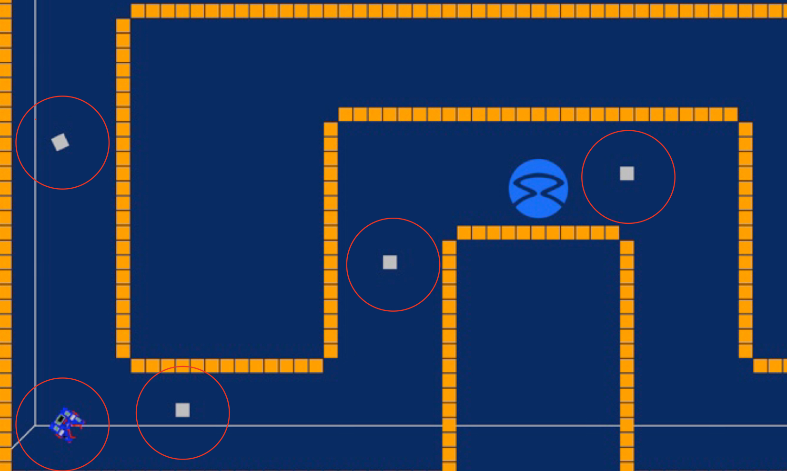

Zhouyang Hong
student ID:5197402

run this script with: python2 run.py ass1.py

If you don't have dependencies, please do the following things:
Open a shell and execute the following command:
$ sudo apt-get udpate
$ sudo apt-get install git
$ git clone https://github.com/CarmineD8/python_simulator
You have downloaded a simple robotic simulator. In order to run it, you should first install:
$ sudo apt-get install python-dev python-pip python-pygame python-yaml
$ sudo pip install pypybox2d# 

overview
This code is consists of two module in terms of the strcture.
The first module is for navigation which allowed the robot to move along the track. The second is for the grabbing silver-token while moving around. Below will introduce both of them respectively.

# navigation
## abstract
For navigation, just like radar we scan the nearest golden token from 4 aspects, which are left,right,front and wide front. With those data, we can keep the robot moving basically along the center of the road with a simple close-loop control technique and making turns to avoid hitting the wall.

The picture above shows how many distances are needed and how did the robot acquire them. I get the closest one through caculation.

## pseudo code
### Scan_nearby:
    Scan:
    Left_golden_dist = the closest distance on left side
    Right_golden_dist = the closest distance on right side
    Front_golden_dist = the closest distance on front side
    Wide_front_golden_dist = the closest distance on wide-front side

### making decision
     #check front
    if Front_golden_dist < 1 # a abstacle in front of us 
            if Left_golden_dist < Right_golden_dist #more space on the right
                turn_right
            else turn_left
            
      #check left and right      
     if Left_golden_dist < Right_golden_dist # we are close to the left 
                slightly move right
     else turn_left
     
      #check wide-front to see if we are to close to anything
    if Wide_front_golden_dist < 0.8 # something is around us 
            if Left_golden_dist < Right_golden_dist #more space on the right
                turn_right
            else turn_left# grabbing-mission

# grabbing silver-token mission
## abstract

In this part, actually we are confronted with a difficult problem which is how to identify if a silver token is the one we already grabbed. To solve this, I took the following strategy. They are:
   
    If the distance is increasing.
    
    If the increasing distance is above a specific value.
    
Undoubtedly the distance is increasing as we move forward, but when we making a turn, the distance might decrease then the robot might move back. So we need to make a judgement, if the increasing distance goes beyond a value, we tell our robot the next one he meet will be a new silver-token and he can just go and. grab it.

in order not to greatly influence the navigation part, I have to set a range for detecting silver-token, which means we only consider sivler robot in such a range. Then, the radius become important and we also need to detect if there are anything between robot and silver token.
## Pseudo code
silver_distance = check_the_nearest_silver_token()

if silver_distance < radius
    if not_the_previous_one and nothing_in_the_middle
        needed_angle = angle_we_need_to_turn()
        turn(needed_angle)
        go_grab_it()
        turn(-needed_angle)
else do_nothing

# conclusion
With the navigation and grabbing-mission modules, we just run them in turn and we can achieve our goal. Navigation module just simply make the robot move along the track without touching anything, when a silver-token is close enough, robot go and grab it.

This is the main idea of my code

# future improvements
So far the robot is able to move along the track and execut mission, but only with a curly track. By adjusting the threshold for robot to decide making a turn, and the magnitude for each direction correction, the track of the robot might be more beautiful in the future.
